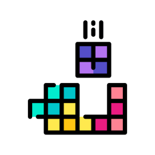

# 🎮 TetrisSFML

Un clásico juego de Tetris implementado en C++ con SFML. Compatible con Windows, Linux (WSL) y macOS.

<div align="center">
  
  <h1>TetrisSFML</h1>
</div>

## ✨ Características

-  **7 tetrominós clásicos** con colores diferenciados
- 🔄 **Rotación de piezas** con wall kick básico
- 👻 **Pieza fantasma** que muestra dónde caerá
- 📊 **Sistema de puntuación** con niveles progresivos
- 🎵 **Controles intuitivos** (teclado)
- 💾 **Código modular** y fácil de extender

## 📦 Requisitos

### Linux (WSL/Ubuntu)
```bash
sudo apt update
sudo apt install -y build-essential libsfml-dev pkg-config
```